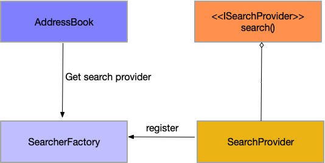

What is Address Book?
--------------

A simple address-book command line lookup application. Address Book takes a single string and returns any matched contacts from the address book in csv format.

Building Address Book
--------------

Address Book can be built as a Docker image.

It is as simple as:

    % make

To remove the Docker image:

    % make clean

Running Address Book
--------------

After building, Address Book runs as a Docker container and can be run like so:

    % ./ab <search-term>

Example
--------------

    % ./ab Alice
    first_name,last_name,address,city,state,zip_code
    Alice,Smith,123 Main St.,Seattle,WA,45

    % ./ab Seattle
    first_name,last_name,address,city,state,zip_code
    Dave,Smith,123 main st.,seattle,wa,43
    Alice,Smith,123 Main St.,Seattle,WA,45
    Carol,Johnson,234 2nd Ave,Seattle,WA,67
    “george",Brown,345 3rd Blvd., Apt. 200,Seattle,WA,19
    Helen,Brown,345 3rd Blvd. Apt. 200,Seattle,WA,18
    Ian,smith,123 main st ,Seattle,Wa,18
    Jane,Smith,123 Main St.,Seattle,WA,13

Or a partial query string:

    % ./query sea
    first_name,last_name,address,city,state,zip_code
    Dave,Smith,123 main st.,seattle,wa,43
    Alice,Smith,123 Main St.,Seattle,WA,45
    Carol,Johnson,234 2nd Ave,Seattle,WA,67
    “george",Brown,345 3rd Blvd., Apt. 200,Seattle,WA,19
    Helen,Brown,345 3rd Blvd. Apt. 200,Seattle,WA,18
    Ian,smith,123 main st ,Seattle,Wa,18
    Jane,Smith,123 Main St.,Seattle,WA,13

Project Planning
------------------

Information on project planning can be found [here](planning/initiative.md)

Design
------

A major goal in the design of this tool is to ensure extensibility for any queryable
data source. The initial motivation envisions a localized csv-formatted file as the be all,end all source of data, but alternative data sources, such as a database should be considered. In order for this to occur a data source factory was implemented.

The SearcherFactory class supports the registration of any data source provider. The only requirement is that the provider implement the duck-typed search() method. The application
should not care what the data source is or how it is implemented. The only concerning matter is that the provider adhere to the contract.

The SearcherFactory role is described as such:

### CSVReader

 CSVReader is an implementation of the duck-typed ISearchProvider interface (this is not actually represented by any code), but what it means is that a SearchProvider *must* implement the search() method at a minimum.

CSVReader is the concrete implementation whose purpose is to read a csv-formatted file from the local filesystem. Its other major functionality is to generate a dictionary n-gram index for the entire corpus. This allows for search against the corpus using partial search criteria.

Try the Database Searcher
----------------

* Modify config.yaml
* Comment out csv reader config
* Uncomment dbreader
* Run make

